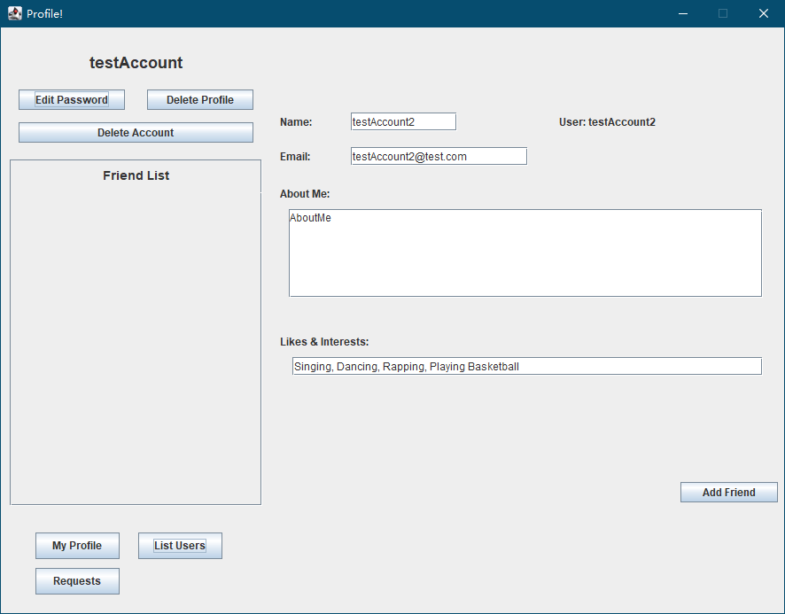
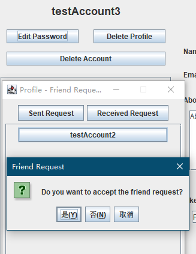
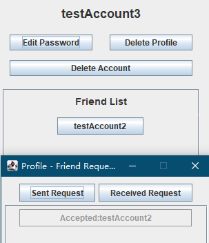

# CS 180 Project 5 - A Social Network "Profile" Application

## Implementations

## GUI Interactions

- **Note: Since pop-up message boxes are implemented by using `JOptionPane`, the text of buttons is default to be the language of your local computer.**

### 1. Connection Check

- When `Server` is running properly, the `ProfileClient` first tries to connect to the server on port `6868`.

  - If connection is successfully established, you will receive a notification:

      

  - If connection is not established, you will receive an error message, and the program will end.

      

### 2. **Login** Frame is then shown

- 

  - **Username** Field: Enter your username
  - **Password** Field: Enter your password
  - **Login** Button: Login with entered username and password
  - **Register** Button:
    - A new frame will be displayed.

      

      - **Username** Field: Enter your username
      - **Password** Field: Enter your password
      - **Register** Button: Create your account with entered username and password. *Note: a blank profile is created when a new account is created.*
        - Username should be no longer than 15 characters, only English letters and numbers are applicable
        - Password should be at least 8 characters and no longer than 21 characters, only English letters and numbers are applicable
      - **Cancel** Button: Close this box and return to **Login** Frame.

### 3. **Main** Frame is shown once you are logged in

- **Delete Profile** Button:
  - If you choose "Yes" on the following confirmation message box, all your data will be reset to blank.
- **Delete Account** Button:
  - If you choose "Yes" on the following confirmation message box, you will be asked to enter your password to confirm your deletion. If the password is correct, you will be ask to confirm again.

    

    - If you ultimately confirm the deletion, your account is removed from the server database, and you can no longer login with your username and password unless you create a new account. You are logged out and the program exits immediately.
- **My Profile** Button: Load my profile. This button is used to "load my profile" if you are visiting someone else's profile.
  - Your profile is automatically updated from the server every 0.5 second.
  - You can always go back to your profile with this button.
- **List Users** Button:
  - You can see all the other users from this frame.

     

    - You can view someone's profile if you click on the button with one's username. Profile file will be loaded on the **Main** Frame

        

      - **Add Friend** Button: Send a friend request to the person whose profile you are visiting. If a friend request is sent already, you will be notified that request is already sent.
        - The button will not be visible if you are visiting your personal profile or someone else's profile if one is already your friend.
        - You can always go back to your profile with **My Profile** button.
- **Requests** Button:
  - You can choose either to view the request you sent or view the request you received by clicking on respective buttons.
    - In **Received Request**, you can accept or reject a request by clicking on the button. *Either accepted or rejected will make the friend request not visible to both users. There will be a temporary indication for accepting or rejecting a request.*

      

      

      - If accepted, both can see their newly added friend in their **Friend List**.
        - You can click on the button with your friend's username to view his/hers profile. You can always go back to your profile with **My Profile** button.
    - In **Sent Request**, you can see the requests you already send. If the request is either accepted or rejected you will not long see it.

        

- **Save** Button: Save your current modification on your personal profile and upload it to the server.
  - The button will not be visible if you are visiting someone else's profile
- **Cancel** Button: Discard your current modification on your personal profile and reload your profile.
  - The button will not be visible if you are visiting someone else's profile

## Description of Each Class

* **Account**
  * Creates an Account object with the client's username and password
  * Methods:
    * **getPassword()**: returns client's password
    * **getUsername()**: returns client's username
  * Implements Serializable for ObjectInputStream and ObjectOutputStream classes
  
* **Profile**
  * Creates a Profile object with user's name, account, email, aboutMe, likes and interests, and an array of friend usernames
  * The constructor initializes the length of sentFriendRequests and receivedFriendRequests arrays to zero
  * Methods:
    * **getAccount()**: returns an Account object
    * **getReceivedFriendRequests()**: returns an array of FriendRequest objects received from other users
    * **getSentFriendRequests()**: returns an array of FriendRequest objects sent to other users
    * **getFriendUserNames()**: returns a String array of usernames of  friended users
    * **getLikesAndInterests()**: returns user's likes and interests
    * **getAboutMe()**: returns user's "About Me" page
    * **getEmail()**: returns user's email
    * **getName()**: returns user's name
    * **setName(String name)**: updates user's name with the given new name
    * **setEmail(String email)**: updates user's email with the given new email
    * **setAboutMe(String aboutMe)**: updates user's "About Me" page with the newly given string of texts
    * **setLikesAndInterests(String likesAndInterests)**: updates user's likes and interests with the newly given string of texts
    * **setFriendUserNames(String[] friendUserNames)**: updates user's friend list
    * **setReceviedFriendRequests(String[] receivedFriendRequests)**: updates an array of received friend requests
    * **setSentFriendRequests(String[] sentFriendRequests)**: updates an array of sent friend requests
    * **addToFriendUsernames(String username)**: adds a username to the friend list
  * Implements Serializable for ObjectInputStream and ObjectOutputStream classes
  
* **FriendRequest**
  * Creates a FriendRequest object with the usernames of the sender and the recipient. Uses an integer variable to keep track of the status of the request (-1: refused; 0: pending; 1: accepted).
  * Methods:
    * **getUsernameWhoReceive()**: returns the username of the recipient
    * **getUsernameWhoSent()**: returns the username of the sender
    * **getStatus()**: returns the status of the request
    * **setStatus(int status)**: updates the status of the request
  * Implements Serializable for ObjectInputStream and ObjectOutputStream classes
  
* **ProfileClient**
  * Client class that is capable of simultaneous use by multiple users over the same network
  * Manages all the GUI interfaces
  * Methods in the ActionListener:
  * Other methods:
    * **userLogin(String username, String password)**: lets the user to login with the given username and password by sending the request to the server. If either username or password is incorrect, it displays an error message. Otherwise, a new Profile object is created with the given username and password.
    * **userRegister(String username, String password)**: lets the user to register with the given username and password by sending the request to the server. If there's a username that already exists, it displays an error message. Then, it returns to the login page.
    * **showLoginPanel()**: displays the login page
    * **showRegisterPanel()**: displays the register page
    * **showMainPanel()**: displays the main page, which lays out all the info saved in the user's profile as well as the user's friendlist. Inside the ActionListener: the main panel is updated for every 0.5 seconds. If the connection is lost with the server, it displays an error message.
    * **showListAllUserPanel()**: displays a panel of all users in the server. Invokes the **addUsernameButton(String username, JPanel targetPanel)** method to add buttons of all users to the list.
    * **showFriendRequestPanel()**: displays a panel for sending and receiving friend requests. In the first ActionListener, the status of each friend request is displayed as either "Pending", "Accepted", or "Rejected", depending on the status of the friend request. In the second ActionListener, the FriendRequest object is set to disappear whether it is declined or accepted by the user. The third ActionListener handles prompting the user to either accept or decline the friend request and depending on the user's choice, the user's friend list is updated.
    * **requestUserList()**: returns a String array of all users in the server by sending a request to the server.
    * **addUsernameButton(String username, JPanel targetPanel)**: if the username of the user matches with the given username, it returns. Inside an ActionListener, a request is sent to the server to add a username button for the user to use to access other users' profile page
    * **resizePanel(JPanel targetPanel)**: updates the size of the specified panel
    * **initializeNetwork()**: creates a new socket along with ObjectInputStream and ObjectOutputStream. Sends an initial request to the server for connection. Displays an appropriate message accordingly.
    * **sendRequest(Object request)**: send a request of any type of object for the server to be read using the ObjectOutputStream. Reads in the received response from the server using the ObjectInputStream. Catches any possible exceptions. Displays an error message if the connection with the server is lost.
    * **loadInfo(Profile profile)**: updates the text fields with the currently saved info in the user's profile.
    * **updateMyProfile()**: sends a request to the server for the profile to be updated.
    * **isConnectionLost()**: returns false when the connection between the client and the server is lost.
    * **run()**: connects to the server by invoking the **initializeNetwork()** method and displays the login panel by invoking the **showLoginPanel()** method.
    * **main(String[] args)**: excutes the **run()** method asynchronously.
  * Implements Serializable for ObjectInputStream and ObjectOutputStream classes
* **Server**
  * Server class that is able to simulatenously hold multiple users by using assignging a new thread for each client
  * All the saved data during the use of the application persists regardless of whether or not a user is connected to the server
  * Methods:
    * **serveClients()**: 
    * **closeServer()**: writes all the array of data back to the files, then closes the server.
    * **writeProfilesToFile(String filename)**: writes any type of data in the Profile object to the file using the ObjectOuputStream
    * **readProfilesFromFile(String filename)**: reads a Profile object from the file using the ObjectInputStream. Catches any possible exceptions in the process.
    * **getProfiles()**: returns an array of Profile objects
    * **setProfiles(Profile[] profiles)**: updates an array of Profile objects with the given new array of Profile objects
    * **main(String[] args)**: creates a new Server object using the designated port number. Saves server data when the server is interrupted at any point. Invokes the **serveClients()** method to run a new thread for the client.
* **ServerRequestHandler**
  * Request Handler used for the server to handle the requests sent from the client
  * Implements Runnable interface 
  * Methods:
    * **getResponse(Object request)**: synchronized to avoid race conditions. Updates the ServerRequestHandler data from Server. Handles all the requests made from the client. All responses are either Profile or String objects
    * **run()**: overridden **run()** method using the ObjectInputStream as the reader and ObjectOutputStream as the writer. If there is any TCP error, catches the Exception and prints an error message.
    * **login(String username, String password)**: checks for credentials from the arraylist, then returns user details if the given info (username and password) is valid.
    * **returnProfileFromUsername(String username)**: returns the Profile object that belongs to the given username
    * **updateProfile(Profile profileToUpdate)**: updates the given Profile object 
    * **usernameIsTaken(String username)**: returns true if the given username is already taken. Otherwise, returns false
    * **profileRequest(Profile profile)**: if the username already exists, updates it with the new profile. If the username does not exist, profile is added. Returns the indnex of the new or updated profile.
    * **deleteProfile(String username)**: deletes the profile of the given username by removing the user from the array of all users.
    * **deleteAccount(String username)**: deletes an account of the given username by removing the user from the array of all users.
    * **acceptFriendRequest(String senderUsername, String recipientUsername)**: deletes friendRequest from sender's and recipient's records. Adds to both users' friend lists
    * **rejectFriendRequest(String senderUsername, String recipientUsername)**: deletes friendRequest from the sender's and  recipient's records
    * **sendFriendRequest(String senderUsername, String recipientUsername)**: creates a new FriendRequest object, then adds it to both users' respective arrays. Returns false if either username is invalid.
    * **rescindFriendRequest(String senderUsername, String recipientUsername)**: invokes the **rejectFriendRequest(String senderUsername, String recipientUsername)** method with the given parameters. Deletes the friendRequest from sender's and recipient's records.
    * **friendRequestAlreadyExists(String senderUsername, String recipientUsername**: returns true if the friend request has already been sent. Otherwise, returns false.
    * **userAreFriends(String username1, String username2)**: returns true if the given two users are friended. Otherwise, returns false.
    * **removeSpaceAtStart(String input)**: removes the first character in the given String if it is blank
  * Implements synchronization while handling the request to control the access of multiple threads

## Testing

* **AccountTest**
  
  * Tests if the class exists or not
  * Tests if the class inherits correctly or not(if it doesn't inherit any classm then it mean it inherits Object class)

  * Tests if the field exists or not
  * Tests if the field has correct type or not
  * Tests if the field has the correct modifier or not
  
  * Tests if the method exists or not
  * Tests if the method has correct parameters or not
  * Tests if the method has correct modifiers or not
  * Tests if the method has correct return type or not
  * Tests if the method retrives properly or not
  
* **FriendRequestTest**

  * Tests if the class exists or not
  * Tests if the class inherits correctly or not(if it doesn't inherit any classm then it mean it inherits Object class)

  * Tests if the field exists or not
  * Tests if the field has correct type or not
  * Tests if the field has the correct modifier or not

  * Tests if the method exists or not
  * Tests if the method has correct parameters or not
  * Tests if the method has correct modifiers or not
  * Tests if the method has correct return type or not
  * Tests if the method retrives properly or not
  
* **ProfileTest**
  
  * Tests if the class exists or not
  * Tests if the class inherits correctly or not(if it doesn't inherit any classm then it mean it inherits Object class)

  * Tests if the field exists or not
  * Tests if the field has correct type or not
  * Tests if the field has the correct modifier or not

  * Tests if the method exists or not
  * Tests if the method has correct parameters or not
  * Tests if the method has correct modifiers or not
  * Tests if the method has correct return type or not
  * Tests if the method retrives properly or not
  
* **ProfileClientTest**

  * Test if the class exists or not
  * Test if the class inherits correctly or not(if it doesn't inherit any classm then it mean it inherits Object class)

  * Test if the field exists or not
  * Test if the field has correct type or not
  * Test if the field has the correct modifier or not

  * Test if the method exists or not
  * Test if the method has correct parameters or not
  * Test if the method has correct modifiers or not
  * Test if the method has correct return type or not
  * Test if the method retrives properly or not
* **ServerTest**

  * Tests if the class exists or not
  * Tests if the class inherits correctly or not(if it doesn't inherit any classm then it mean it inherits Object class)

  * Tests if the field exists or not
  * Tests if the field has correct type or not
  * Tests if the field has the correct modifier or not

  * Tests if the method exists or not
  * Tests if the method has correct parameters or not
  * Tests if the method has correct modifiers or not
  * Tests if the method has correct return type or not
  * Tests if the method retrives properly or not
  
* **ServerRequestHandlerTest**

  * Tests if the class exists or not
  * Tests if the class inherits correctly or not(if it doesn't inherit any classm then it mean it inherits Object class)

  * Tests if the field exists or not
  * Tests if the field has correct type or not
  * Tests if the field has the correct modifier or not

  * Tests if the method exists or not
  * Tests if the method has correct parameters or not
  * Tests if the method has correct modifiers or not
  * Tests if the method has correct return type or not
  * Tests if the method retrives properly or not
